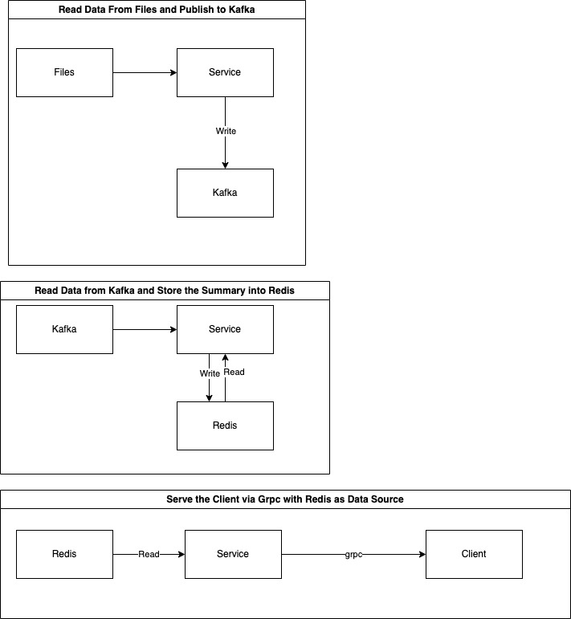

## SBZU

SBZU is a high performance stock recorder which record previous price, open price, the highest price, the lowest price, volume, value, and average price of a stock within a day

It's written in go, using redis as database and kafka as message broker.

There is layer for logic under usecase folder, and for accessing database under repo folder.

Redis and kafka is wrapped in its own interface, so we can mock them for unit test.

Below is the general diagram for this app

